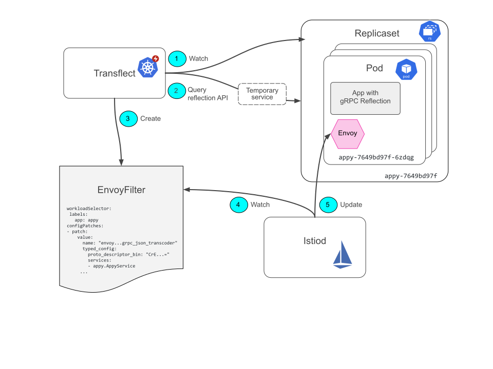

# Inner workings of transflect

Transflect is a **Kubernetes operator** that uses **Istio** to set up Envoy's
[gRPC-JSON transcoding](https://www.envoyproxy.io/docs/envoy/latest/configuration/http/http_filters/grpc_json_transcoder_filter)
via the Istio **EnvoyFilter** resources.

An
[`EnvoyFilter`](https://istio.io/latest/docs/reference/config/networking/envoy-filter/)
is a Kubernetes custom resource specific to Istio.
[Istiod](https://istio.io/latest/docs/ops/deployment/architecture) watches
EnvoyFilters. It updates the Envoy sidecar configurations of all Pods with a
matching `workloadSelector`.

The EnvoyFilter created by transflect sets up a
[gRPC-JSON transcoder filter](https://www.envoyproxy.io/docs/envoy/latest/configuration/http/http_filters/grpc_json_transcoder_filter)
for all pods of a deployment with transflect annotation.

The transflect operator runs a control loop keeping resources in sync and
ensuring that there is always a transflect EnvoyFilter for any Kubernetes
Deployment that should have one and none extra. It also ensures that the
EnvoyFilter is upgraded with new gRPC API rollouts.

A transflect EnvoyFilter resource contains dynamic information retrieved from
the Deployment's gRPC reflection API:

- List of gRPC services, see `services`
- Base64 encoded protoset file, ie compiled proto files,
  see`proto_descriptor_bin`

Sample abridged EnvoyFilter resource for deployment `appy`

```yaml
workloadSelector:
  labels:
    app: appy
configPatches:
  - patch:
      value:
        name: envoy.filters.http.grpc_json_transcoder
        typed_config:
          services: [appy.AppyService, grpc.reflection.v1alpha.ServerReflection]
          proto_descriptor_bin: CrE7CiBnb29nbGUvcHJ...=
```

For service continuity it is assumed that only backwards compatible API changes
are rolled out.

In order to guarantee that only Pods with new versions of an API are being
queried during a rollout a temporary Kubernetes Service is set up connecting
only to the new pods.


